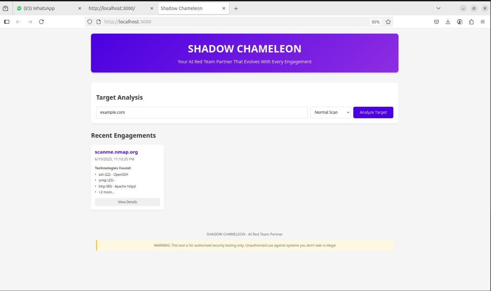
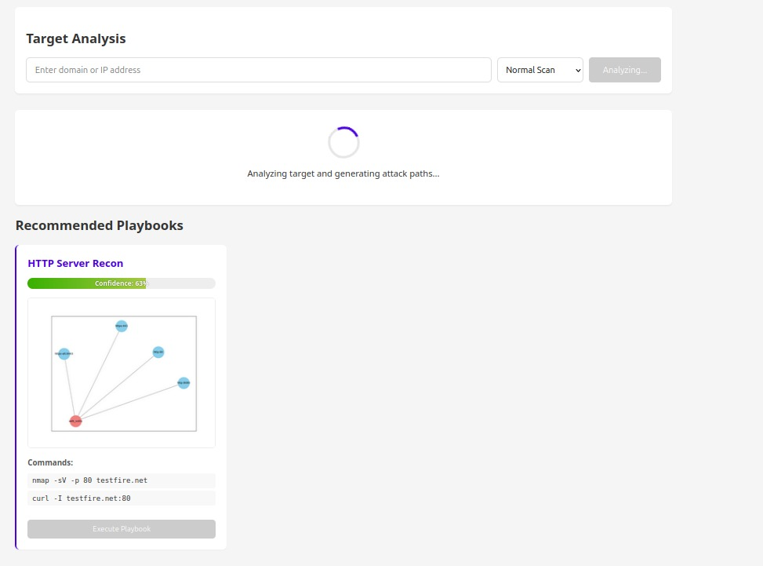
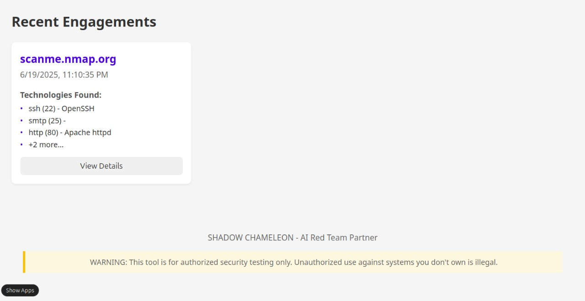
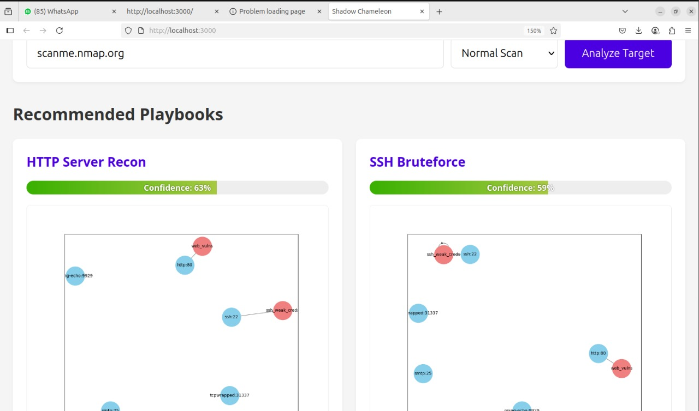

# 🦎 SHADOW CHAMELEON - AI Red Team Partner



Your **AI Red Team Partner** that evolves with every engagement.

---

## 📌 Overview

**SHADOW CHAMELEON** is an AI-powered red teaming tool that:

- Automatically analyzes target systems
- Generates custom attack playbooks
- Visualizes attack paths and vulnerability chains
- Learns from each engagement
- Integrates into your existing security workflows

---

## ✨ Key Features

- 🔍 **Automated Target Analysis** – Scans domains/IPs to identify services and vulnerabilities  
- 🧠 **AI-Powered Playbook Generation** – Recommends context-aware, sequenced attacks  
- 🌐 **Attack Path Visualization** – Interactive graph of discovered vulnerability chains  
- 🛠️ **Command Execution** – Execute tools like Nmap, Hydra, curl directly from the UI  
- 📁 **Engagement History** – Logs and reviews previous red team activities  

---

## 🚀 Quick Start

### ✅ Prerequisites

- Python 3.8+
- Node.js 14+
- Nmap installed

### ⚙️ Installation

```bash
# Clone the repository
git clone https://github.com/yourusername/shadow-chameleon.git
cd shadow-chameleon
```

#### Backend Setup

```bash
cd backend
python -m venv venv
source venv/bin/activate  # For Linux/Mac
# venv\Scripts\activate   # For Windows

pip install -r requirements.txt
```

#### Frontend Setup

```bash
cd ../frontend
npm install
```

### ▶️ Running the Application

```bash
# In backend directory
uvicorn main:app --reload
```

```bash
# In frontend directory
npm start
```

Access the web interface at: **http://localhost:3000**

---

## 🎯 Sample Inputs and Outputs

### 1. 🔎 Target Analysis

**Input:**
```json
{
  "target": "scanme.nmap.org",
  "scan_depth": "normal"
}
```

**Output:**
```json
[
  {
    "playbook_id": "ssh_bruteforce",
    "name": "SSH Bruteforce",
    "confidence": 0.78,
    "commands": [
      "nmap -sV scanme.nmap.org",
      "hydra -l root -P /usr/share/wordlists/rockyou.txt ssh://scanme.nmap.org"
    ],
    "visualization": "base64-encoded-image"
  },
  {
    "playbook_id": "http_recon",
    "name": "HTTP Server Recon",
    "confidence": 0.65,
    "commands": [
      "nmap -sV -p 80 scanme.nmap.org",
      "curl -I scanme.nmap.org:80"
    ],
    "visualization": "base64-encoded-image"
  }
]
```



---

### 2. 🧪 Playbook Execution

**Input:**
```json
{
  "playbook_id": "ssh_bruteforce",
  "commands": [
    "hydra -l root -P /usr/share/wordlists/rockyou.txt ssh://scanme.nmap.org"
  ]
}
```

**Output:**
```json
{
  "success": true,
  "output": [
    {
      "command": "hydra -l root -P /usr/share/wordlists/rockyou.txt ssh://scanme.nmap.org",
      "success": false,
      "output": "[ERROR] Connection closed by remote host"
    }
  ],
  "learned_patterns": {
    "ssh_pattern": "SSH brute force attempted"
  }
}
```


---

### 3. 📚 Engagement History

**Request:** `GET /engagements`  
**Output:**
```json
[
  {
    "id": "eng_20231025_143022",
    "target": "scanme.nmap.org",
    "timestamp": "2023-10-25T14:30:22.54321",
    "tech_stack": {
      "services": [
        {"port": "22", "name": "ssh", "product": "OpenSSH"},
        {"port": "80", "name": "http", "product": "Apache"}
      ]
    },
    "results": [
      {
        "playbook_id": "ssh_bruteforce",
        "name": "SSH Bruteforce",
        "confidence": 0.78
      }
    ]
  }
]
```



---

## 🖼️ Screenshots

- **Main Interface**  
  

- **Analysis in Progress**  
  

- **Playbook Recommendations**  
  

- **Attack Graph Visualization**  
  

---

## ⚠️ Known Issues

- Burp Suite integration not implemented
- Visualizations may fail with complex graphs
- Only limited commands are allowed (security reasons)
- Manual configuration required for Shodan API
- Performance may vary with scan depth/network latency

---

## 🔮 Future Development

- ✅ Burp Suite plugin integration  
- ✅ Machine Learning for attack pattern recognition  
- ✅ Expand playbook generation database  
- ✅ Multi-target scanning and aggregation  
- ✅ Auto-generated PDF/HTML reports  
- ✅ Team collaboration dashboard and permissions  

---

## 📜 License

Distributed under the **MIT License**. See `LICENSE` for full details.

---

## ⚠️ Legal Warning

> This tool is intended **only for authorized security testing**.  
> Unauthorized scanning or exploitation of systems you don’t own or have explicit permission to test is **illegal**.  
> By using SHADOW CHAMELEON, you agree to use it **only for ethical and legal purposes**.

---

🔥 _Stay stealthy. Stay sharp. Stay evolving._
